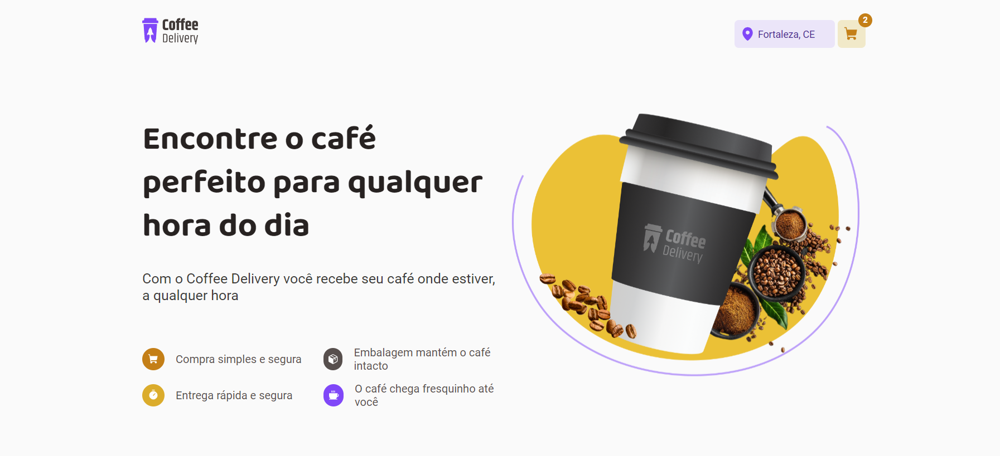

# coffee-delivery

## :rocket: Sobre

O coffee-delivery é uma aplicação para gerenciar um carrinho de compras de uma cafeteria fictícia e trabalhar os conceitos como - Estados
- ContextAPI
- LocalStorage
- Imutabilidade do estado
- Listas e chaves no ReactJS
- Propriedades
- Componentização

## Preview

### Funcionalidades:

- Listagem de produtos (cafés) disponíveis para compra
- Adicionar uma quantidade específicas de itens no carrinho
- Aumentar ou remover a quantidade de itens no carrinho
- Formulário para o usuário preencher o seu endereço
- Exibir o total de itens no carrinho no Header
- Exibir o valor total da soma de itens no carrinho multiplicados pelo valor

## Para rodar o projeto na maquina local :

1 - Clone o projeto:
  git clone https://github.com/Andersonsilvamota/coffee-delivery.git
  
2 - Entre na pasta:
  cd coffee-delivery

3 - Instale as depedências:
  npm i
  
4- Rode o projeto:
  npm run dev
